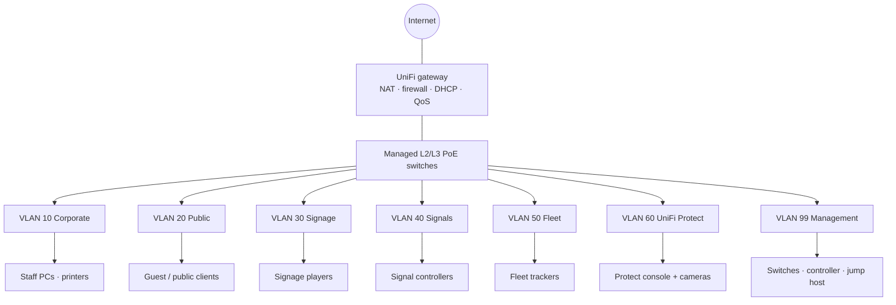

# Network Infrastructure Upgrade

**Computer Plus Solutions** · portfolio write-up by [Ngu Brice Che](https://github.com/supbrice)

This repository documents a business network I designed and deployed: gateways, managed Layer 2/3 PoE switches, VLAN zoning, UniFi Protect on a PoE camera topology, NAT/QoS policy, and the checks used to validate the build.

Configs and addresses here are **sanitized examples** that match the design. They are not a dump of a customer controller.

Related experience that shaped the validation work: IT support at **MTN** (DNS, DHCP, VPN, firewalls, endpoint monitoring, and segmentation for 100+ users).

---

## Problem

The site mixed staff PCs, guest/public access, and operational technology (digital signage, signals, fleet tracking) on a flat or poorly segmented LAN. Cameras and access points needed reliable PoE. Vendor-hosted OT systems needed outbound reach without opening a path into corporate traffic.

The upgrade had to do four things:

1. Segment **public**, **corporate**, and **OT** traffic.
2. Power and backhaul UniFi Protect cameras without starving other PoE devices.
3. Enforce NAT, routing, and QoS so OT and staff traffic could not freely mix.
4. Leave a repeatable way to prove links, DNS/DHCP, and zone isolation after cutover.

---

## Design

### Zones and VLANs

| Zone | VLAN | Subnet | Purpose |
| --- | --- | --- | --- |
| Corporate | 10 | `10.10.10.0/24` | Staff workstations, printers, file/print |
| Public | 20 | `10.10.20.0/24` | Guest / public Wi-Fi — internet only |
| OT Signage | 30 | `10.10.30.0/24` | Digital displays, content players |
| OT Signals | 40 | `10.10.40.0/24` | Signaling / control endpoints |
| OT Fleet | 50 | `10.10.50.0/24` | Vehicle / asset tracking gateways |
| Protect | 60 | `10.10.60.0/24` | UniFi Protect cameras and console |
| Management | 99 | `10.10.99.0/24` | Gateway, switches, controller, jump host |

Full table, DHCP scopes, and DHCP/DNS options: [`docs/vlan-plan.md`](docs/vlan-plan.md) · [`docs/vlan-plan.csv`](docs/vlan-plan.csv)

### Topology



### Isolation, NAT, and QoS

Default stance: **deny inter-VLAN**, then allow only what a zone needs.

| From | To | Policy |
| --- | --- | --- |
| Public | Anywhere except internet | Deny |
| Corporate | Internet | Allow via NAT |
| Corporate | OT / Protect | Deny (admin jump host on VLAN 99 only) |
| OT Signage / Signals / Fleet | Vendor-hosted destinations | Allow specific outbound; NAT |
| OT | Corporate / Public / other OT | Deny |
| Protect cameras | Protect console | Allow on VLAN 60 |
| Protect | Internet / Corporate | Deny |
| Management | All zones | Allow from jump host for ops |

QoS on the gateway:

- **Signals and fleet** — highest queue (latency-sensitive control and tracking).
- **Protect video** — reserved bandwidth so recordings do not burst into OT or staff traffic.
- **Corporate** — default business class.
- **Public** — scavenger / lowest. Guest cannot starve staff or OT.

Example rule sets: [`configs/unifi/firewall-and-nat.md`](configs/unifi/firewall-and-nat.md) · [`configs/unifi/networks.json`](configs/unifi/networks.json)

### PoE and UniFi Protect

Cameras and APs sit on the same PoE switching layer as the rest of the access edge. The console stays on VLAN 60 so detections and recordings stay local (UniFi Protect’s on-device analytics — not a cloud SIEM).

Work on this piece:

- Per-switch **power budget** vs camera + AP draw, with headroom for PoE negotiation spikes.
- Camera ports as **PoE + VLAN 60 access**; uplinks as tagged trunks.
- Confirm **Fast Ethernet (100 Mbps)** data sync on copper runs that would not train at gigabit — still enough for 1080p/2K Protect streams if the link is clean.

Budget worksheet and calculator: [`docs/poe-budget.csv`](docs/poe-budget.csv) · [`scripts/poe_budget.py`](scripts/poe_budget.py)  
Protect port notes: [`configs/unifi/protect.md`](configs/unifi/protect.md)

### Layer 2 adoption loops

UniFi switches and cameras that had lived on another controller would adopt, drop, and reappear. Typical cause: stale inform URL in NVRAM plus Layer 2 discovery fighting the current gateway.

Fix sequence used on site:

1. Factory **NVRAM reset** (hardware reset or `syswrapper.sh restore-default` over SSH).
2. Confirm the device is on the management or Protect VLAN with a DHCP or static address.
3. SSH **set-inform** to the current controller, then wait for adoption — do not re-adopt from a second inform host.

Runbook: [`docs/adoption-and-validation.md`](docs/adoption-and-validation.md)

### Validation and monitoring

After each IDF and after cutover:

- Ping and latency to each zone gateway.
- DNS resolution from corporate and public clients.
- DHCP scope behavior (correct gateway, DNS, and lease range per VLAN).
- Confirm public and OT clients cannot reach the corporate gateway (DNS/53 or ICMP).
- Spot-check vendor-hosted OT URLs from the OT VLANs only.

Scripts that encode those checks:

```bash
python3 scripts/validate_network.py --plan docs/vlan-plan.csv --profile demo
```

```powershell
./scripts/Test-NetworkHealth.ps1 -Plan docs/vlan-plan.csv -Profile demo
```

`--profile demo` uses public DNS/HTTPS targets so the scripts can run off-site. `--profile live` uses the VLAN gateways and vendor hostnames in the plan.

Ongoing monitoring is the UniFi controller (device up/down, PoE faults, adopt state) plus scheduled runs of the same scripts against staff and vendor-hosted endpoints. No Prometheus/Grafana stack was part of this project.

---

## Repository layout

```
docs/                  VLAN plan, PoE budget, adoption/validation notes
configs/unifi/         Example networks, firewall/NAT/QoS, Protect ports
scripts/               Python and PowerShell checks + PoE calculator
```

## What this is not

This repo does **not** cover AWS, GCP, Jenkins, or a claimed percentage cut in deployment time. Those were leftover from an older generic README and are not part of this work.

## Contact

[linkedin.com/in/ngubriceche](https://www.linkedin.com/in/ngubriceche) · [github.com/supbrice](https://github.com/supbrice)
